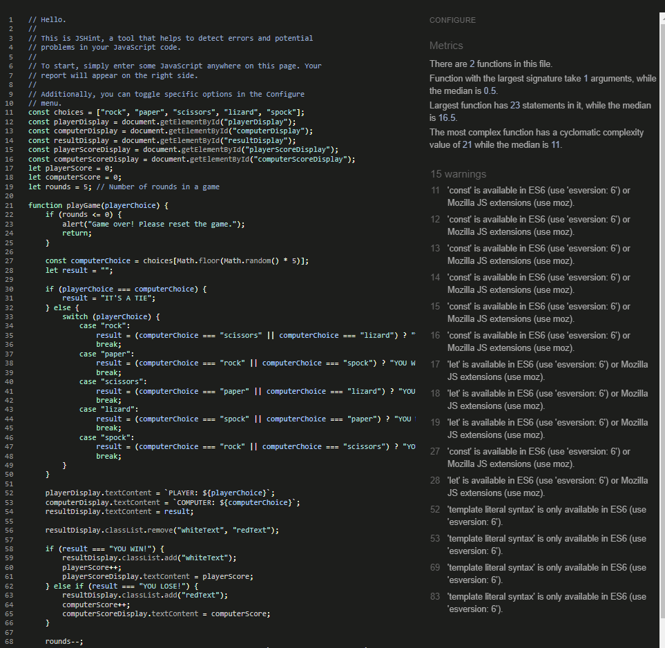
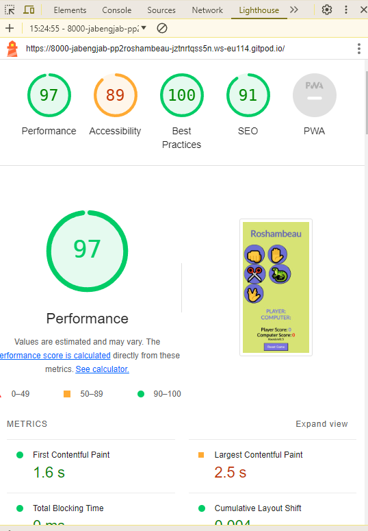
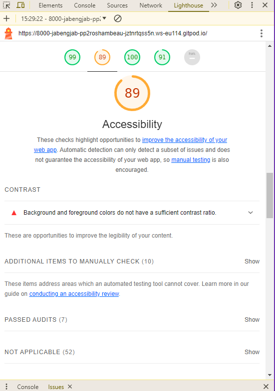
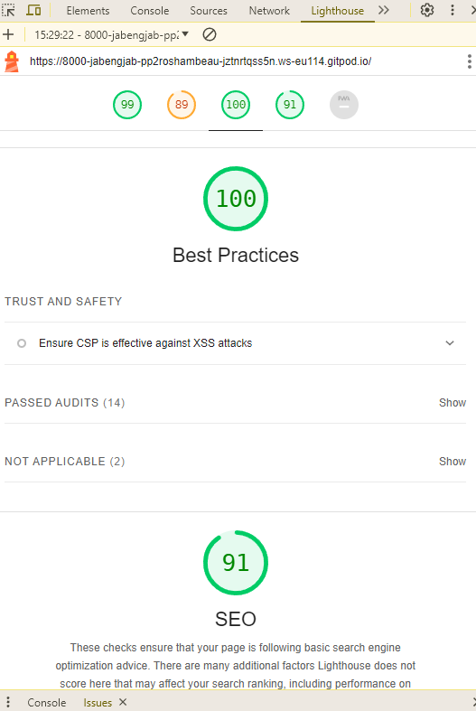

# Roshambeau

Roshambeau (Rock-Paper-Scissors-Lizard-Spock) is a web-based game where players can compete against the computer. This project demonstrates basic HTML, CSS, and JavaScript integration to create an interactive and visually appealing game.

## Table of Contents

- [Usage](#usage)
- [Game Rules](#game-rules)
- [Features](#features)
- [File Structure](#file-structure)
- [Technologies Used](#technologies-used)
- [Features left to implement](#features-left-to-implement)
- [Testing](#testing)
- [Deployment](#deployment)

## Usage

1. Open the index.html file in your web browser.

2. Select one of the options: Rock, Paper, Scissors, Lizard, or Spock by   clicking on the respective button.

3. The game will display your choice, the computer's choice, and the result of the round.

4. The game keeps track of the scores and the number of rounds left.

5. Click the "Reset Game" button to restart the game.

## Game Rules

* Rock crushes Scissors and crushes Lizard.

* Paper covers Rock and disproves Spock.
* Scissors cuts Paper and decapitates Lizard.
* Lizard eats Paper and poisons Spock.
* Spock smashes Scissors and vaporizes Rock.

## Features

* Responsive design that adapts to different screen sizes (smartphones, tablets, and larger screens).

* Interactive game buttons with hover effects.

* Dynamic display of player and computer choices.

* Real-time score tracking.
* Easy game reset functionality.

## File Structure

## Technologies Used

* HTML5
* CSS3
* JavaScript
* Font Awesome
* Google Fonts

### Features Left to Implement

#### Add sound effects
* For each button (choices) when clicked on. This will make the game more lively.

#### Multiplayer mode implementation
* To make the game more interactive and fun for users to play against other users.

#### Leaderboard
* A player ranking system based on their performance (score), for more competition and also for the user to track their progress.

## Testing

I tested the project on an iphone12 and a Samsung Galaxy s8 and worked fine on both. I then went on to test on a Huawei tablet and also a Laptop with 15 inch display and it also worked fine. Also then went on to test on a desktop with no problems.

I also tested the project on [Bytes](https://bytes.dev/?s=amiresponsive) to see how it also displays. Screenshot is at the beginning of this readme.
### Validator Testing

#### Url
No errors were returned when passing through the official [W3c validator](https://jigsaw.w3.org/)

#### HTML 

No errors were returned when passing through the official [W3c validator](https://jigsaw.w3.org/)

#### CSS
No errors were found when passing through the official [Jigsaw validator](https://validator.w3.org/nu/)

#### jsHint
* No major errors were found on jsHint as I run the code through just warnings.

#### Lighthouse

##### Performance

##### Accessibility

##### Best practices and SEO

## Deployment

The site was deployed to GitHub pages. The steps to deploy are as follows:

In the GitHub repository, navigate to the Settings tab

From the source section drop-down menu, select the Master Branch

Once the master branch has been selected, the page will be automatically refreshed with a detailed ribbon display to indicate the successful deployment.

The live link can be found here - https://jabengjab.github.io/PP2-Roshambeau-Andrew-Djaba/

## Bugs

* Accessibility after using lighthouse is 89%. I left it as it is due to time. This will be fixed in due time.

* The alignment of the emojis on an iPhone is not perfect. Having plans to fix that in the future

## Credits

### Contents
* The fonts for the webpage was sourced from Google Fonts ( https://fonts.google.com/)

### Acknowlegdements

* Thanks to the Code Institutes Love Maths walkthrough project, I got the idea to of how to structure my functions in the script.js for example.

* Tutor support was also a great help to me. I was never stuck again after I communicated my problem with them.

